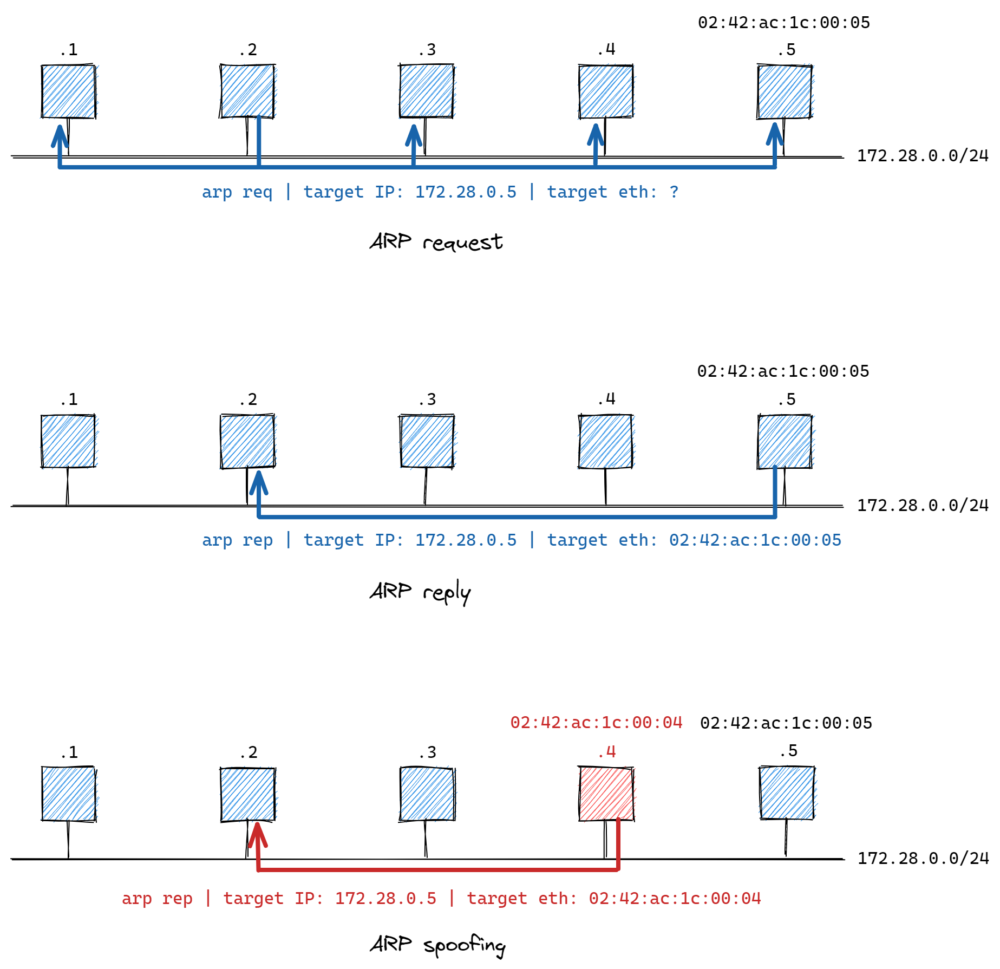
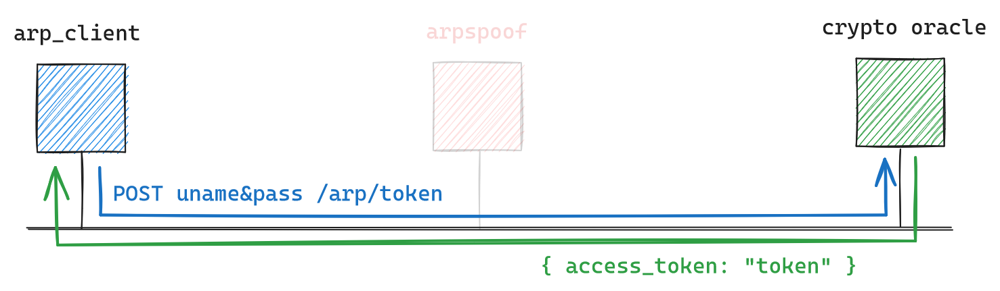
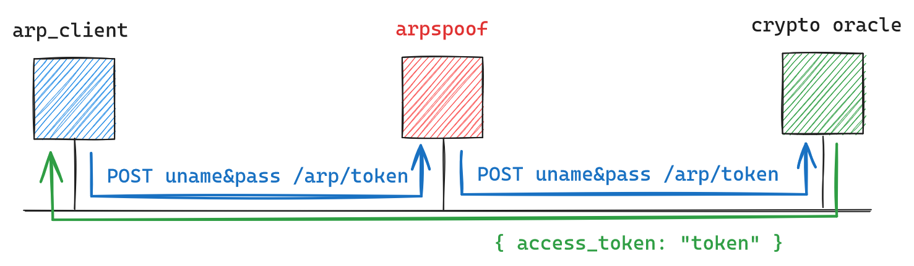

# **Kriptografija i mrežna sigurnost** <!-- omit in toc -->

- [Lab 2: Man-in-the-middle attack](#lab-2-man-in-the-middle-attack)
  - [ARP spoofing](#arp-spoofing)
  - [Zadatak](#zadatak)
    - [Otkrijte `password`](#otkrijte-password)
    - [Dohvatite `token`](#dohvatite-token)
    - [Dohvatite tajni `cookie`](#dohvatite-tajni-cookie)
    - [Izvedite `key` za dekripciju](#izvedite-key-za-dekripciju)
    - [Dekriptirajte `challenge`](#dekriptirajte-challenge)
  - [Pohranite rješenje u GitLab repo](#pohranite-rješenje-u-gitlab-repo)

# Lab 2: Man-in-the-middle attack

Upoznajemo se sa osnovnim sigurnosnim prijetnjama i ranjivostima u računalnim mrežama. Analizirat ćemo ranjivost _Address Resolution Protocol_-a (_ARP_) koja omogućava _**Man in the Middle (MitM)**_ napad na računala koja dijele zajedničku lokalnu mrežu (LAN, WLAN).

## ARP spoofing

<p align="center">

</p>

## Zadatak

Dekriptirati izazov (_challenge_) enkriptiran _AES šifrom u CBC enkripcijskom modu rada_ (AES-CBC). Dekripcijski ključ potreban za dekripciju izazova otkrit ćete u interakciji s _crypto oracle_ serverom. Ključ je izveden iz tajne koju zovemo **`cookie`**, primjenom [`derive_key` funkcije](https://github.com/mcagalj/CNS-2023-24/blob/8ccff6ebc06793d59c5b0397560c2ae8afe3923b/crypto-oracle/app/crypto.py#L52). U navedenoj funkciji, `cookie` se koristi kao `key_seed` argument.

Tajni `cookie` možete dobiti slanjem sljedećeg REST API zahtjeva _crypto oracle_ serveru: `GET /arp/cookie`. Za ovaj zahtjev treba vam autentikacijski `token` kojeg također možete zatražiti od _crypto oracle_ servera uz uvjet da imate odgovarajuće `korisničko ime` (ime vašeg Docker _container_-a) i `zaporku`.

Zadatak u fazama: `username & password` ⇒ `token` ⇒ `cookie` ⇒ `key` ⇒ `challenge`.

### Otkrijte `password`

Tekuća faza: **`username & password`** ⇒ `token` ⇒ `cookie` ⇒ `key` ⇒ `challenge`.

<p align="center">

</p>

Računalo `arp_client` periodično se logira na _crypto oracle_ server i zatraži autentikacijski token. _Crypto oracle_ odgovara slanjem tokena. Iskoristite ranjivost ARP protokola i izvršite MitM napad na način da presretnete komunikaciju između `arp_client`-a i _crypto oracle_ servera te doznate `password`.

<p align="center">

</p>

Za izvođenje napada koristite specijalizirano napadačko računalo koje u nazivu ima sufiks `_arpspoof`.

1. Otvorite dva (2) _remote_ terminala na svom napadačkom računalu:

    ```bash
    ssh <username>@10.0.15.x
    ```

2. Otkrijte MAC i IP adrese za _crypto oracle_, `arpspoof` i `arp_client` računala. Pomognite se alatima `ifconfig`, `ping` i `arp`.

3. Jedan terminal koristite za osluškivanje prometa na lokalnoj mrežnoj kartici. Za ovo korisite `tcpdump`.

    ```bash
    sudo tcpdump
    ```

4. Drugi terminal koristite za izvršavanje **_ARP spoofing_** napada. Koristite program `arpspoof`.

    ```bash
    # Usage: arpspoof [-i interface] [-c own|host|both] [-t target] [-r] host
    sudo arpspoof
    ```

    > VAŽNO: MitM napad izvršite na način da presretnete komunikaciju u smjeru od `arp_client`-a prema _crypto_oracle_ serveru; lažno se predstavite `arp_client`-u kao _crypto_oracle_.

5. Nakon što ste pokrenuli napad, u prvom terminalu filtrirajte ARP pakete kako slijedi:

    ```bash
    sudo tcpdump arp and host arp_client.macvlan
    ```

    Komentirajte rezultat.

6. Popunite sljedeću tablicu podacima iz zaglavlja mrežnih paketa koje žrtva (_crypto_oracle_) šalje `arp_client` računalu:

    |               | `MAC`<sub>src</sub> | `MAC`<sub>dst</sub> | `IP`<sub>src</sub> | `IP`<sub>dst</sub> |
    | :------------ | :------------------ | :------------------ | :----------------- | :----------------- |
    | before attack |                     |                     |                    |                    |
    | after attack  |                     |                     |                    |                    |

7. Traženi `password` možete doznati primjenom odgovarajućeg `tcpdump` filtera:

    ```bash
    sudo tcpdump -vvAls0 | grep "password"
    ```

    Pohranite `password` i prekinite napad (`Ctrl + C`).

### Dohvatite `token`

Tekuća faza: `username & password` ⇒ **`token`** ⇒ `cookie` ⇒ `key` ⇒ `challenge`.

### Dohvatite tajni `cookie`

Tekuća faza: `username & password` ⇒ `token` ⇒ **`cookie`** ⇒ `key` ⇒ `challenge`.

### Izvedite `key` za dekripciju

Tekuća faza: `username & password` ⇒ `token` ⇒ `cookie` ⇒ **`key`** ⇒ `challenge`.

> HINT: U [`derive_key` funkciji](https://github.com/mcagalj/CNS-2023-24/blob/8ccff6ebc06793d59c5b0397560c2ae8afe3923b/crypto-oracle/app/crypto.py#L52) `cookie` se koristi kao `key_seed` argument.

### Dekriptirajte `challenge`

Tekuća faza: `username & password` ⇒ `token` ⇒ `cookie` ⇒ `key` ⇒ **`challenge`**.

> HINT: Iskoristite kod sa prošlih labova.
>
> **REMINDER**: Dio enkriptiranog izazova je i zaporka za otključavanje sljedeće vježbe. Testirajte dekriptiranu zaporku.

## Pohranite rješenje u GitLab repo

Potrebno pohraniti:

1. Popunjenu tablicu sa `MAC` i `IP` adresama (`README.md`).
2. Dekriptiran izazov (`README.md`).
3. Python skriptu s pripadajućim kodom (`solution.py`).
