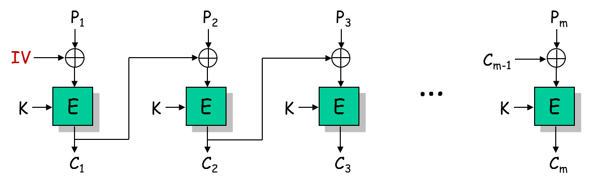
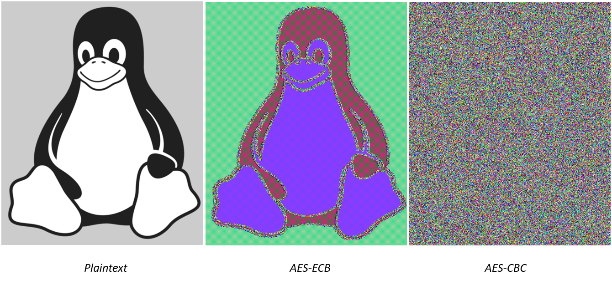
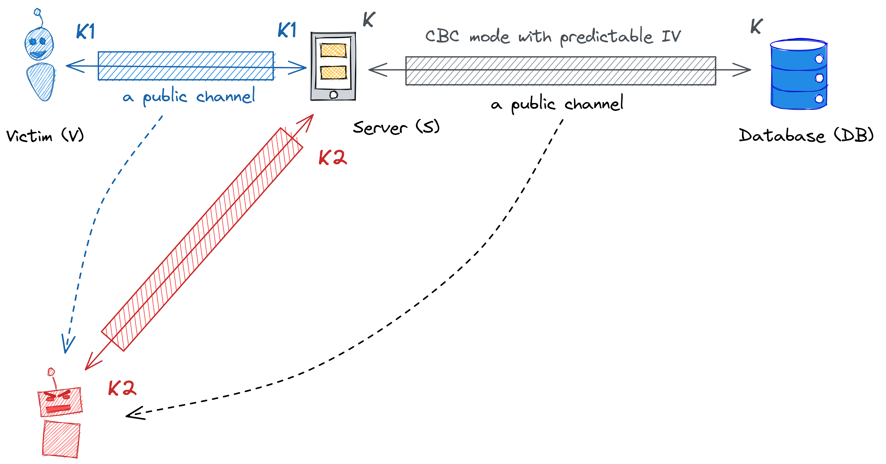

# **Kriptografija i mrežna sigurnost** <!-- omit in toc -->

- [Lab 5: Randomized encryption (CBC mode)](#lab-5-randomized-encryption-cbc-mode)
    - [Predictable IV implies insecure CBC](#predictable-iv-implies-insecure-cbc)
      - [Pretpostavke](#pretpostavke)
      - [Chosen-plaintext attack (CPA)](#chosen-plaintext-attack-cpa)
  - [Zadatak](#zadatak)
    - [Dohvatite `token`](#dohvatite-token)
    - [Otkrijte tajni `cookie`](#otkrijte-tajni-cookie)
    - [Smjernice za Python](#smjernice-za-python)
      - [Get static file `wordlist.txt` and iterate over it](#get-static-file-wordlisttxt-and-iterate-over-it)
      - [Plaintext padding](#plaintext-padding)
      - [Conversion `bytes` to `hex` string](#conversion-bytes-to-hex-string)
      - [XOR-ing two large binary strings](#xor-ing-two-large-binary-strings)
      - [Conversion `int` to `bytes` and `hex` representation](#conversion-int-to-bytes-and-hex-representation)
    - [Rješenje](#rješenje)


# Lab 5: Randomized encryption (CBC mode)

_Cipher Block Chaining (CBC)_ **probabilistički** je način enkripcije poruka primjenom blok šifri (npr., AES). Blok šifre rade s blokovima fiksne duljine (npr., AES koristi 128 bitne blokove). Poruke dulje od nominalne duljine bloka zadane šifre enkriptiramo na način da poruku podijelimo/razbijemo na više blokova prije enkripcije.

Kod CBC enkripcijskog moda _plantext_ blokovi se ulančavaju (eng. _chaining_) kako je prikazano na slici u nastavku; prisjetite se, u ECB modu pojedini blokovi enkriptiraju se neovisno.

<p align="center">

<br><br>
<em>Enkripcija u CBC modu</em>
</p>

Uz pretpostavku da se primjenjena blok šifra (npr. AES) ponaša kao **pseudo-random permutacija/funkcija**, ulančavanjem se postiže _nasumičnost_ šifriranog _plaintext_-a. Uloga _inicijalizacijskog vektora (IV)_ je randomizacija prvog bloka _plaintext_-a. CBC enkripcijski mod osigurava povjerljivost poruka uz određene pretpostavke. Formalno govoreći, CBC mod zadovoljava svojstvo _Indistinguishability under Chosen Plaintext Attack (IND-CPA)_ - napadač ne može razlikovati koja od dvije poruke, po napadačevom izboru, je enkriptirana na osnovu _ciphertext_-a u igri koju smo opisali u okviru predavanja (na predavanjima smo ovu definiciju sigurnosti nazvali _CPA-security_).

Važan preduvjet za sigurnost CBC moda je **nepredvidivost inicijalizacijskog vektora**. Korištenjem koncepata slučajnih varijabli (_random variable_) i entropije, za blok šifru veličine bloka _n_ inicijalizacijski vektor _IV_ je slučajna varijabla  _IV_ &isin; {0, 1}<sup>_n_</sup> i ima entropiju _H(IV)=n_ bitova.

> RAZMISLITE O OVOME: Iako inicijalizacijski vektor treba biti nepredvidiv do trenutka neposredno prije enkripcije _plaintext_-a, jednom kad je _plaintext_ enkriptiran inicijalizacijski vektor postaje javna vrijednost (dio je _ciphertext_-a).

U nastavku je slikovito prikazana prednost CBC u odnosu na ECB mod; identična slika karakterizirana visokim stupnjem redudancije enkripritana je u ECB i CBC modu (primjenom AES blok šifre).

<p align="center">

<br>
<em>ECB vs CBC</em>
</p>

### Predictable IV implies insecure CBC

U nastavku je prikazan scenarij na kojem ćemo naprije teoretski pokazati ranjivost CBC enkripcijskog moda u slučaju kada se inicijalizacijski vektor bira na predvidiv način. U scenariju razlikujemo žrtvu (_victim V_) i napadača (_attacker A_), koji su oboje legitimni korisnici servera _S_. Pretpostavljamo da _V_ i _A_ imaju siguran kanal uspostavljen sa serverom. S druge strane, server _S_ podatke primljene od _V_ i _A_ enkriptira i pohranjuje u udaljenu bazu podataka _DB_. Podaci između servera i baze podataka enkripirani su u CBC modu, istim ključem, pri čemu se IV bira na predvidljiv način.

> Napadač _A_ može predvidjeti IV koji će server _S_ koristiti za enkripciju svih _plaintext_-ova. Također pretpostavljamo da napadač ima pristup svim javnim kanalima i shodno tome može saznati sve _ciphertext_-ove razmjenjene putem tih kanala.

Pretpostavimo da _V_ i _A_ ispunjavaju anketu gdje se trebaju odrediti po pitanju nekakve društveno/politički/religiozno delikatne teme sa odgovorom podržavam (_yes_) ili ne podržavam (_no_).

<p align="center">

<br>
<em>Scenario za napad na CBC mode u slučaju predvidljivog IV-a</em>
</p>

#### Pretpostavke

1. IV je predvidiv:
   - IV<sub>i+1</sub> &larr; IV<sub>i</sub> + `const`
   - IV<sub>0</sub> se bira nasumično, a `const` je poznata fiksna vrijednost

2. Moguće poruke od žrtve:
   - P &isin; {`yes`, `no`}

3. Server koristi CBC enkripciju s istim enkripcijskim ključem za sve korisnike.

#### Chosen-plaintext attack (CPA)

| Tko šalje | Što šalje                                                                                    | Napomena                                                               |
| :-------- | :------------------------------------------------------------------------------------------- | :--------------------------------------------------------------------- |
| V → S     | p<sub>V</sub> = `yes` or `no`                                                                | over secure channel                                                    |
| S → DB    | IV<sub>V</sub>, C<sub>V</sub> = E<sub>K</sub>(p<sub>V</sub> \|\| `padding` ⊕ IV<sub>V</sub>) | over channel using CBC encryption                                      |
| A → S     | p<sub>A</sub> = `yes` \|\| `padding` ⊕  IV<sub>V</sub> ⊕  IV<sub>next</sub>                  | attacker A can predict IV<sub>next</sub>                               |
| S → DB    | IV<sub>next</sub>, C<sub>A1</sub> = E<sub>K</sub>(p<sub>A</sub> ⊕ IV<sub>next</sub>)         | over CBC channel, C<sub>A1</sub> 1st ciphertext block of C<sub>A</sub> |

Napadač _A_ zna sljedeće javne informacije: 

1. zna da je žrtva odabrala `yes` ili `no`
2. zna IV<sub>V</sub> i C<sub>V</sub> jer ih server šalje javnim kanalom
3. može predvidjeti IV<sub>next</sub>
4. zna C<sub>A1</sub> (prvi ciphertext block) jer ih server šalje javnim kanalom

Uvjerite se da vrijedi sljedeće: **if C<sub>V</sub> == C<sub>A1</sub> then p<sub>V</sub> = `yes` else p<sub>V</sub> = `no`**.

## Zadatak

Zadatak studenta u okviru vježbe je dekriptirati odgovarajući izazov (_challenge_). Izazov je, kao i u prethodnoj vježbi, enkriptiran AES šifrom u CBC enkripcijskom modu, ključem izvedenim iz tajne vrijednosti _cookie_. Student će saznati tajni _cookie_ (potreban za dekripciju izazova) iskorištavanjem ranjivosti CBC enkripcijskog moda u slučaju kada je inicijalizacijski vektor predvidiv.

Zadatak u fazama: `username & password` ⇒ `token` ⇒ `cookie` ⇒ `key` ⇒ `challenge`.

Prisjetite se, _password_ ste otkrili u prethodnoj vježbi.

### Dohvatite `token`

Tekuća faza: `username & password` ⇒ **`token`** ⇒ `cookie` ⇒ `key` ⇒ `challenge`.

### Otkrijte tajni `cookie`

Tekuća faza: `username & password` ⇒ `token` ⇒ **`cookie`** ⇒ `key` ⇒ `challenge`.

> **VAŽNO: Tajni `cookie` je riječ odabrana nasumično iz javno dostupne liste _wordlist.txt_. Listu možete dohvatiti sa servera kao statički resurs na stazi `static/wordlist.txt`.**

Tajni `cookie` je enkriptiran u CBC enkripcijskom modu. Enkriptirani `cookie` možete dobiti na putanji `/cbc/iv/encrypted_cookie`.

Vaš zadatak je izvršiti _chosen-plaintext attack (CPA)_ slanjem odgovarajućih `plaintext` poruka serveru, koji će ih enkriptirati u CBC modu i vratiti vam odgovarajući `ciphertext`. Server **odabire IV na predvidiv način (ne nasumično)**, što vam omogućava predviđanje sljedećeg inicijalizacijskog vektora  IV<sub>next</sub>. Koristeći ovu činjenicu i determinističku prirodu enkripcijske šifre, možete testirati potencijalne riječi iz javnog rječnika tako da ih prilagodite i pošaljete crypto oracleu na enkripciju, te usporedite dobivene odgovore s `ciphertext`-om_ koji odgovara enkripciji .

>**VAŽNO**: Za ovu vježbu, plaintext poruke koje šaljete serveru treba enkodirati u `hex` formatu (vidjeti smjernice za Python).

### Smjernice za Python

Možete iskoristiti djelove koda sa prethodnih vježbi. U nastavku su navedene samo neke specifičnosti za tekuću vježbu.

#### Get static file `wordlist.txt` and iterate over it

```python
def get_wordlist(url):
    response = requests.get(url)
    response.raise_for_status()
    return response.content

# Get the wordlist
path = "static/wordlist.txt"
wordlist = get_wordlist("http://<HOST_IP>/static/wordlist.txt")

# Iterate the wordlist    
for word in wordlist.split():
    print(f"\nTesting word: {word}")
```

#### Plaintext padding

Koristi se PKCS#7 standard:

```python
from cryptography.hazmat.primitives import padding

def add_padding(word: bytes) -> int:
    padder = padding.PKCS7(128).padder()
    padded_word = padder.update(word)
    padded_word += padder.finalize()
    return padded_word


def test_padding():
    for i in range(1, 17):
        word = b"a" * i
        padded_word = add_padding(word)
        print(f"word: {word} ({len(word)} bytes)")
        print(f"padded_word: {padded_word.hex()}\n")
```

#### Conversion `bytes` to `hex` string

```python
b"test".hex()
```

#### XOR-ing two large binary strings

Za _xor_ operaciju (⊕) podataka tipa `bytes` prethodno ćemo ih convertirati u `int`.

```python
# bytes to int
A_int = int.from_bytes(A_bytes, byteorder="big")
B_int = int.from_bytes(B_bytes, byteorder="big")

# xor
C_int = A_int ^ B_int
```

#### Conversion `int` to `bytes` and `hex` representation 

```python
# int to bytes
C_bytes = C_int.to_bytes(16, "big")

# bytes to hex string
C_hex = C_bytes.hex()
```

### Rješenje

```python
from base64 import b64decode

import requests
from cryptography.hazmat.primitives import padding
from cryptography.hazmat.primitives.ciphers import Cipher, algorithms, modes
from cryptography.hazmat.primitives.kdf.scrypt import Scrypt
from pydantic import BaseModel


class Ciphertext(BaseModel):
    iv: str
    ciphertext: str


class Challenge(BaseModel):
    iv: str
    ciphertext: str


def get_access_token(username, password, url):
    response = requests.post(
        url,
        headers={"Content-Type": "application/x-www-form-urlencoded"},
        data={"username": username, "password": password},
    )
    response.raise_for_status()
    return response.json().get("access_token")


def encrypt_chosen_plaintext(plaintext: str, token: str, url: str) -> str:
    response = requests.post(
        url=url,
        headers={
            "Authorization": f"Bearer {token}",
            "Content-Type": "application/json",
        },
        json={"plaintext": plaintext},
    )

    response.raise_for_status()
    return response.json()


def get_challenge(url):
    response = requests.get(
        url,
        headers={"Content-Type": "application/x-www-form-urlencoded"},
    )
    response.raise_for_status()
    return response.json()


def decrypt_challenge(key: bytes, challenge: Challenge) -> str:
    """Decrypts encrypted challenge; reveals a password that can be
    used to unlock the next task/challenge.
    """
    iv = b64decode(challenge.iv)
    ciphertext = b64decode(challenge.ciphertext)

    cipher = Cipher(algorithms.AES(key), modes.CBC(iv))
    decryptor = cipher.decryptor()
    plaintext = decryptor.update(ciphertext)
    plaintext += decryptor.finalize()

    unpadder = padding.PKCS7(128).unpadder()
    plaintext = unpadder.update(plaintext)
    plaintext += unpadder.finalize()
    return plaintext.decode()


def derive_key(key_seed: str, key_length=32) -> bytes:
    """Derives encryption/decryption key from the given key_seed.
    Uses modern key derivation function (KDF) scrypt.
    """
    kdf = Scrypt(
        salt=b"",
        length=key_length,
        n=2**14,
        r=8,
        p=1,
    )
    key = kdf.derive(key_seed.encode())
    return key


def get_wordlist(url):
    response = requests.get(url)
    response.raise_for_status()
    return response.content


def get_encrypted_cookie(url):
    response = requests.get(url)
    response.raise_for_status()
    return response.json()


def get_current_iv(url, token):
    response = encrypt_chosen_plaintext(
        plaintext=b"bilo sto".hex(), token=token, url=url
    )
    iv = response.get("iv")
    return iv


def add_padding(word: bytes) -> int:
    padder = padding.PKCS7(128).padder()
    padded_word = padder.update(word)
    padded_word += padder.finalize()
    return padded_word


def test_padding():
    for i in range(1, 17):
        word = b"a" * i
        padded_word = add_padding(word)
        print(f"word: {word} ({len(word)} bytes)")
        print(f"padded_word: {padded_word.hex()}\n")


if __name__ == "__main__":
    username = "doe_john"
    password = "sseraymeeh"
    url = "http://10.0.15.20/cbc/token"

    # Step 1: Get the token
    token = get_access_token(username, password, url)
    print(f"Token: {token}")

    # Step 2: Get the wordlist
    url = "http://10.0.15.20/static/wordlist.txt"
    wordlist = get_wordlist(url)

    # Step 3: Get the encrypted cookie and its IV
    url = "http://10.0.15.20/cbc/iv/encrypted_cookie"
    response = get_encrypted_cookie(url)
    ciphertext = Ciphertext(**response)
    cookie_iv = b64decode(ciphertext.iv)
    cookie_ciphertext = b64decode(ciphertext.ciphertext)

    cookie_iv = int.from_bytes(cookie_iv, byteorder="big")
    print(f"Cookie IV: {cookie_iv}")

    # Step 4: Get/learn the current IV
    url = "http://10.0.15.20/cbc/iv"
    iv = get_current_iv(url, token)
    current_iv = b64decode(iv)

    current_iv = int.from_bytes(current_iv, byteorder="big")
    print(f"Current IV: {current_iv}")

    # Step 5: Start the chosen-plaintext attack
    cookie = ""
    for word in wordlist.split():
        print(f"\nTesting word: {word}")
        
        # 5.1 Calculate the IV for the next word
        next_iv = current_iv + 4

        # 5.2 Pad the candidate word
        padded_word = add_padding(word)
        print(f"Padded word: {padded_word.hex()}")
        padded_word = int.from_bytes(padded_word, byteorder="big")

        # 5.3 Prepare chosen plaintext (hex encoded)
        chosen_plaintext = 
        chosen_plaintext = chosen_plaintext.to_bytes(16, "big").hex()
        print(f"[*] Plaintext: {chosen_plaintext}") 

        # 5.4 Send the chosen plaintext to the server
        response = encrypt_chosen_plaintext(
            plaintext=chosen_plaintext,
            token=token,
            url=url,
        )
        
        ciphertext = Ciphertext(**response)
        iv = b64decode(ciphertext.iv)
        ciphertext = b64decode(ciphertext.ciphertext)        
        
        # 5.5 Verify if the candidate word matches the encrypted cookie
        if ...


        # 5.6 Update the current IV
        current_iv = int.from_bytes(iv, byteorder="big")
        print(f"[*] Current IV: {current_iv}")

        
    # Step 6: Derive the key from the cookie
    key = derive_key(key_seed=cookie)

    # Step 7: Get the challenge
    url = 
    response = get_challenge(url)
    challenge = Challenge(**response)
    
    # Step 8: Decrypt the challenge
    plaintext = 
    print(f"\nDecrypted challenge: {plaintext}")

```
