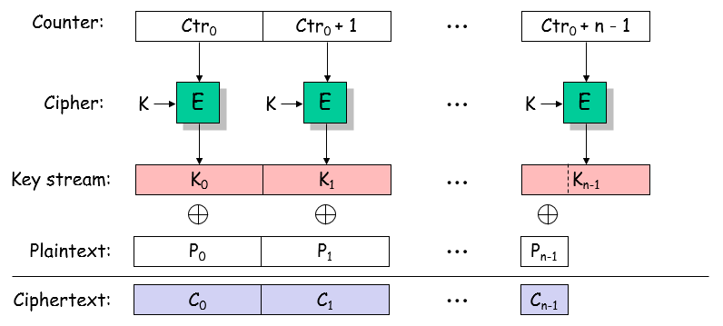

# **Kriptografija i mrežna sigurnost** <!-- omit in toc -->

- [Lab 6: A stream cipher based on a block cipher (CTR mode)](#lab-6-a-stream-cipher-based-on-a-block-cipher-ctr-mode)
  - [Zadatak](#zadatak)
    - [Dohvatite `token`](#dohvatite-token)
    - [Dekriptirajte `challenge`](#dekriptirajte-challenge)
    - [Korisne smjernice za Python](#korisne-smjernice-za-python)
      - [XOR-ing two large binary strings](#xor-ing-two-large-binary-strings)
      - [Conversion `int` to `bytes` and `hex` representation](#conversion-int-to-bytes-and-hex-representation)
      - [Converting `bytes` to a string (`str`)](#converting-bytes-to-a-string-str)

# Lab 6: A stream cipher based on a block cipher (CTR mode)

Slično CBC modu, _Counter (CTR) encryption mode_ **probabilistički** je način enkripcije poruka, gdje se _plaintext_ enkriptira jednostavnom _xor_ operacijom s generiranim _pseudo-slučajnim_ nizom ključeva (_pseudorandom key stream_). Pseudo-slučajan niz ključeva generira se na način da se danom blok šiftom (npr. AES) enkriptiraju sukcesivne vrijednosti brojača (_counter_) kako je prikazano na priloženoj slici.

<p align="center">

<br><br>
<em>Enkripcija u CTR modu</em>
</p>

CTR mod enkripcije siguran je način enkripcije (osigurava povjerljivost podataka) ali uz važan preduvjet: **isti brojač (_counter_) ne smije se ponoviti (enkriptirati više puta) pod istim enkripcijskim ključem _K_**. Zašto?

## Zadatak

Zadatak studenta je dekriptirati odgovarajući izazov koji je u ovoj vježbi enkriptiran korištenjem CTR enkripcijskog moda. Ranjivost _crypto oracle_ servera u ovoj vježbi proizlazi iz činjenice da se **brojač Ctr<sub>0</sub> bira (nasumično) iz ograničenog/malog skupa brojeva**. Posljedica opisanog načina generiranja brojača za CTR mod je ta da će se nakon određenog broja enkripcija brojač ponaviti što napadaču omogućuje dekripciju _ciphertext_-a bez poznavanja enkripcijskog ključa.

Zadatak u fazama: `username & password` ⇒ `token` ⇒ `challenge`.

Prisjetite se, _password_ ste otkrili u prethodnoj vježbi.

### Dohvatite `token`

Tekuća faza: `username & password` ⇒ **`token`** ⇒ `challenge`.

### Dekriptirajte `challenge`

Student će iskoristiti gore opisani propust u _crypto oracle_-u i dekriptirati svoj izazov. **U osnovi, nakon što student pošalje dovoljan broj odabranih (_chosen_) poruka serveru, jedna od tih poruka bit će enkriptirana pod istim _counter_-om (i ključem) kao i studentov izazov (šala o Chuck Norris-u).** Uvjerite se da u tom slučaju vrijedi:

C<sub>Chuck_Norris</sub> ⊕ P<sub>Chuck_Norris</sub> = C<sub>chosen_plaintext</sub> ⊕ P<sub>chosen_plaintext</sub>

U osnovi, utjecaj pseudo-slučajnog ključa (_key stream_ na slici) se poništi kada se _plaintext_ poruke enkriptira pod istim _counter_-om Ctr<sub>0</sub>. Iskoristite ovu činjenicu kako biste dekriptirali izazov (P<sub>Chuck_Norris</sub>).

### Korisne smjernice za Python

Iskoristite kod iz prethodnih vježbi. Uvjerite se da je ova vježba u načelu slična vježbi s Vernamovom šifrom (Lab 3).

> VAŽNO: Za razliku od prethodne vježbe (CBC), _chosen plaintext_ poruke koje šaljete _crypto oracle_ će se procesirati kao `utf-8` stringovi (ne trebate ih konvertirati u `hex`).

#### XOR-ing two large binary strings

Za _xor_ operaciju (⊕) podataka tipa `bytes` prethodno ćemo ih convertirati u `int`.

```python
# bytes to int
A_int = int.from_bytes(A_bytes, byteorder="big")
B_int = int.from_bytes(B_bytes, byteorder="big")

# xor
C_int = A_int ^ B_int
```

#### Conversion `int` to `bytes` and `hex` representation 

```python
# int to bytes
C_bytes = C_int.to_bytes(16, "big")

# bytes to hex string
C_hex = C_bytes.hex()
```

#### Converting `bytes` to a string (`str`)

```python
# Default encoding is 'utf-8'
C_as_string = C_as_bytes.decode(errors="ignore")
```

> Postavljanjem argumenta `errors="ignore"` nalažemo interpreteru da ignorira bajtove koji ne mogu biti dekodirani kao `utf-8` znakovi.
