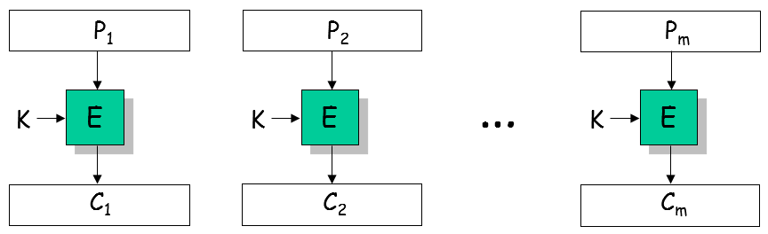
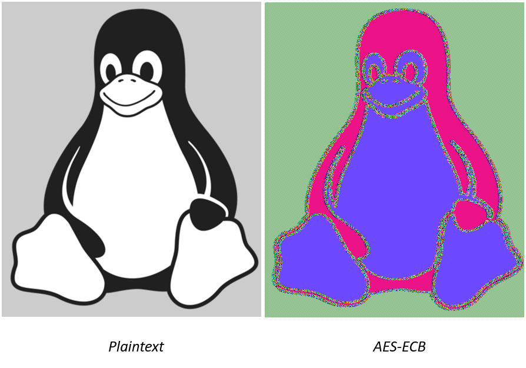
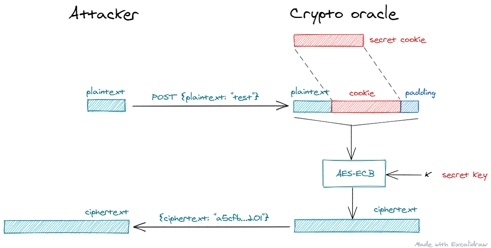

# **Kriptografija i mrežna sigurnost** <!-- omit in toc -->

- [Lab 4: Deterministic encryption (ECB mode)](#lab-4-deterministic-encryption-ecb-mode)
  - [Zadatak](#zadatak)
    - [Dohvatite `token`](#dohvatite-token)
    - [Otkrijte tajni `cookie`](#otkrijte-tajni-cookie)
    - [Izvedite `key` za dekripciju](#izvedite-key-za-dekripciju)
    - [Dekriptirajte `challenge`](#dekriptirajte-challenge)
  - [Pohranite rješenje u GitLab repo](#pohranite-rješenje-u-gitlab-repo)
  - [Smjernice za automatizaciju u Pythonu](#smjernice-za-automatizaciju-u-pythonu)
    - [Spajanje stringova](#spajanje-stringova)
    - [Množenje stringova](#množenje-stringova)
    - [Engleski alfabet](#engleski-alfabet)


# Lab 4: Deterministic encryption (ECB mode)

U okviru ove laboratorijske vježbe, baviti ćemo se izazovom enkripcije poruka duljih od duljine bloka dane šifre/enkripcijskog algoritma (npr., 128 bitova za AES blok šifru). Općenito, u takvim slučajevima poruke se dijele na blokove fiksne duljine koji odgovara duljini bloka korištenog enkripcijskog algoritma te se svaki blok enkriptira na odgovarajući način. _Electronic Codebook (ECB)_ je način enkripcije dugih poruka u kojem se blokovi poruke enkriptiraju neovisno jedan o drugom. Iako intuitivan i jednostavan, **ECB nije siguran**.

Budući da su blok šifre determinističke funkcije (isti ulaz u šifru, pod istim enkripcijskim ključem, uvijek daje isti/predvidljiv izlaz), ECB način enkripcije rezultira **determinističkom enkripcijom**. Posljedično, ako su neki blokovi poruke identični, rezultirat će identičnim _ciphertext_-om, na osnovu čega se može zaključiti da su enkriptirane identične poruke. Ova ranjivost predstavlja značajan rizik za sigurnost enkriptiranih podataka.

<br/>
<p align="center">

<br><br>
<em>Enkripcija u ECB modu</em>
</p>

U vježbi ćemo pokazati da ovakav način enkripcije generalno ne osigurava povjerljivost (_confidentiality_) poruke unatoč tome što koristimo sigurnu šifru (npr., AES ili čak idealnu blok šifru).

<p align="center">

<br>
<em>Problem deterministične enkripcije</em>
</p>

## Zadatak

Dekriptirati odgovarajući izazov (_challenge_) koji je enkriptiran AES šifrom ključem izvedenim iz tajne vrijednosti _cookie_. Student će saznati tajni _cookie_ iskorištavanjem ranjivosti determinističke enkripcije (ECB enkripcijskog moda u ovoj vježbi).

Zadatak u fazama: `username & password` ⇒ `token` ⇒ `cookie` ⇒ `key` ⇒ `challenge`.

Prisjetite se, _password_ ste otkrili u prethodnoj vježbi.

### Dohvatite `token`

Tekuća faza: `username & password` ⇒ **`token`** ⇒ `cookie` ⇒ `key` ⇒ `challenge`.

U ovoj vježbi šaljete `HTTP POST` zahtjeve _crypto oracle_-u na zaštićen _path_ `/ecb`. Za uspješan `POST /ecb` trebate odgovarajući autentikacijski `token` kojeg možete dobiti od _crypto_oracle_ servera u zamjenu za odgovarajući `password`. Prisjetite se, `password` je dio `challenge`-a kojeg ste dekriptirali u prethodnoj vježbi.

### Otkrijte tajni `cookie`

Tekuća faza: `username & password` ⇒ `token` ⇒ **`cookie`** ⇒ `key` ⇒ `challenge`.

Iskoristiti činjenicu da _crypto oracle_ enkriptira _cookie_ u ECB modu (deterministička enkripcija). Slanjem proizvoljne poruke (_plaintext_) _crypto oracle_-u na _path_ `/ecb` isti će napraviti sljedeće:

  1. _crypto oracle_ će uzeti vaš _plaintext_ i spojati ga s tajnim _cookie_-jem (`plaintext + cookie`),
  2. enkriptirati rezultat (tj. `plaintext + cookie`) primjenom AES šifre u ECB modu tajnim ključem,
  3. vratiti vam odgovarajući _ciphertext_ (slika u nastavku).

<br/>
<p align="center">

<br>
</p>

> NAPOMENA: Kao što je vidljivo iz slike, _crypto_oracle_ server će enkriptirati `plaintext + cookie + padding`; gdje se `padding` automatski dodaje iz razloga koje ćemo objasniti naknadno - ovaj detalj nije toliko relevantan za rješavanje tekućeg zadatka.

Nekoliko važnih napomena:

1. Ranjivost ECB moda proizlazi iz činjenice da je lako otkriti podudarnost između dva _plaintext_ bloka tako da usporedite _ciphertext_ blokove dobivene enkripcijom istih _plaintext_ blokova. ECB mod koristi determinističku enkripciju, što znači da će isti _plaintext_ blok uvijek rezultirati istim _ciphertext_ blokom kada se koristi isti enkripcijski ključ.

2. Razmislite kako bi trebali prilagoditi _plaintext_ poruke da bi vam ECB _oracle_ dao potencijalno korisnu informaciju. Koristite primitivna sredstva poput olovke i papira te pokušajte sebi skicirati ovaj problem.

    > Napad u kojem adaptivno prilagođavate _plaintext_ koji šaljete _crypto_oracle_ serveru na enkripciju, od kojeg dobivate odgovarajući _ciphertext_, pada u kategoriju **_chosen-plaintext_** napada.

3. Tajni `cookie` sastoji se od 16 malih slova engleskog alfabeta.

4. Pokušajte otkriti prvi karakter/slovo `cookie`-ja ručno, putem Swager sučelja. Na osnovu spoznaja, automatizirajte process u Python-u za ostala slova.

### Izvedite `key` za dekripciju

Tekuća faza: `username & password` ⇒ `token` ⇒ `cookie` ⇒ **`key`** ⇒ `challenge`.

> HINT: Iskoristite kod sa prošlih labova.

### Dekriptirajte `challenge`

Tekuća faza: `username & password` ⇒ `token` ⇒ `cookie` ⇒ `key` ⇒ **`challenge`**.

> **REMINDER**: Dio enkriptiranog izazova je i zaporka za otključavanje sljedeće vježbe. Testirajte dekriptiranu zaporku.

## Pohranite rješenje u GitLab repo

Potrebno pohraniti:

1. Dekriptiran izazov (`README.md`).
2. Python skriptu s pripadajućim kodom (`solution.py`).

## Smjernice za automatizaciju u Pythonu

### Spajanje stringova

```python
user = "Jean" + "Doe"
# output: "JeanDoe"
```

### Množenje stringova

```python
user = "a"*3
# output: "aaa"
```

### Engleski alfabet

```python
import string

lowercase_alphabet = string.ascii_lowercase
```
