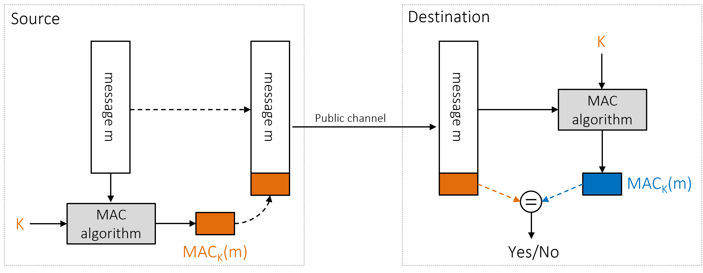
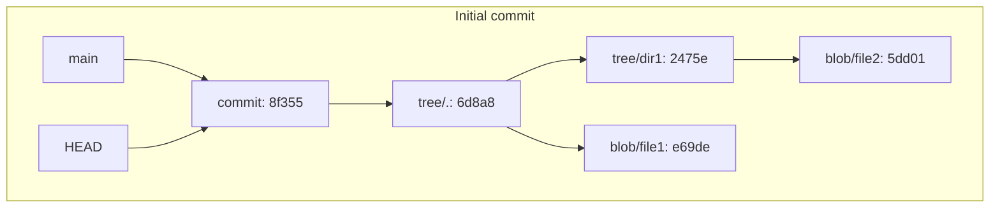
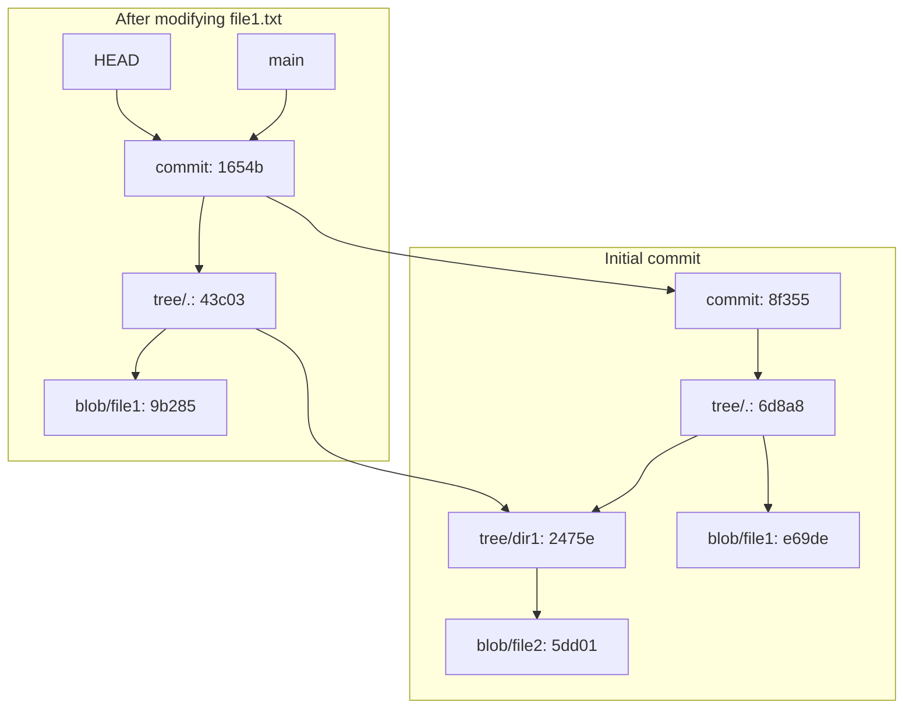
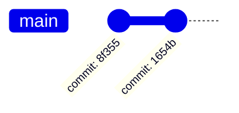

# **Kriptografija i mrežna sigurnost** <!-- omit in toc -->

- [Lab 8: Practical Uses of Cryptographic Hash Functions](#lab-8-practical-uses-of-cryptographic-hash-functions)
  - [Basic digest functions in OpenSSL](#basic-digest-functions-in-openssl)
    - [Hash functions](#hash-functions)
    - [Message Authentication Codes](#message-authentication-codes)
      - [Protecting against replay/delay attacks](#protecting-against-replaydelay-attacks)
      - [Protecting against message reordering attacks](#protecting-against-message-reordering-attacks)
  - [Password hashing](#password-hashing)
  - [JSON Web Token (JWT)](#json-web-token-jwt)
  - [Deep dive into Git internals](#deep-dive-into-git-internals)
    - [Git objects](#git-objects)
    - [Useful commands](#useful-commands)
      - [Syncing content between directories](#syncing-content-between-directories)
      - [Viewing and displaying Git objects information](#viewing-and-displaying-git-objects-information)
    - [Git by example](#git-by-example)
      - [Git tree after the initial commit](#git-tree-after-the-initial-commit)
      - [Git tree after modifying file1.txt](#git-tree-after-modifying-file1txt)
      - [Resulting Git graph](#resulting-git-graph)

# Lab 8: Practical Uses of Cryptographic Hash Functions

## Basic digest functions in OpenSSL

### Hash functions

```bash
openssl dgst --list
```

Calculate hashes of a given message using different hash functions. For example:

```bash
echo "Is this the real life? Is this just fantasy?" | openssl dgst --sha256
```

```bash
echo "Is this the real life? Is this just fantasy?" | openssl dgst --sha512
```

The following one is used in Bitcoin:

```bash
echo "Is this the real life? Is this just fantasy?" | openssl dgst --ripemd160
```

Compare and comment the outcomes. Try to make subtle changes to the hashed message and compare the outputs before and after.

To hash a file content, proceed as follows.

```bash
echo "Is this the real life? Is this just fantasy?" > message.txt
```

```bash
openssl dgst -sha256 message.txt
```

### Message Authentication Codes

We will mainly focus on **Hash-based Message Authentication Code (HMAC)**. Essentially, HMAC is a **keyed hash function** that involves a shared key or secret in addition to a hashed message.

HMAC can be used to authenticate messages using a shared secret key between the sender and receiver. The sender can generate the authentication code (HMAC) and send it along with the message to the receiver (**msg + auth_code**), who can then calculate the HMAC using the same key and verify that it matches the one sent by the sender. This helps to ensure the integrity of the message (i.e., the message has not been modified) and its authenticity (i.e., the message origin/sender is know/confirmed).

Please check [Practical Cryptography for Developers](https://cryptobook.nakov.com/mac-and-key-derivation) for a nice diagram.

<p align="center">

<br>
<em>Message authentication using MAC</em>
<br>
</p>

Use `openssl` and calculate **HMAC-SHA256** of given text messages. For example:

```bash
openssl dgst -sha256 -mac HMAC -macopt key:my_super_secret message.txt
```

#### Protecting against replay/delay attacks

**Q:** _How to detect replay/delay attacks by using HMAC?_

Hint: familiarize yourself with `date` command in Linux.

```bash
date

# timestamp messate.txt
echo $(date) >> message.txt

# check the content
cat message.txt
```

#### Protecting against message reordering attacks

**Q:** _How can we use HMAC to detect out of order messages?_

## Password hashing

In this demonstration, we illustrate the utilization of cryptographic hashing for password security on Linux systems, specifically employing SHA-512 (`sha512crypt`).
Output format of `sha512crypt`: `$6$<salt>$<hashed_password>`.

To learn more about Linux password hashing `crypt` function, run the following command:

```bash
man 5 crypt
```

To manually create `sha512crypt` password hash please follow the following steps:

1. Generate a random 12 byte salt:

    ```bash
    openssl rand -base64 12
    ```

2. Hash a password with salt:

    ```bash
    openssl passwd -6 -salt your_salt_here your_password_here
    ```

3. Create a new user:

    ```bash
    sudo useradd new_username_here
    ```

4. Set password for the user:

    ```bash
     sudo usermod --password 'your_password_hash_here' new_username_here 
    ```

5. Learn current user:

    ```bash
     whoami
    ```

6. Switch to the new user and verify logged user:

    ```bash
     su new_username_here
     whoami
    ```

## JSON Web Token (JWT)

To create a valid JSON Web Token (JWT) using OpenSSL with HMAC, you can follow these steps. JWTs typically consist of three parts: a header, a payload, and a signature. We will demonstrate how to create a JWT with HMAC-SHA256.

1. Prepare header and payload

    Create the `base64`-encoded header and payload for your JWT. The header specifies the algorithm used for the signature (e.g., HMAC-SHA256) and the type of token (JWT).

    ```bash
    # Base64-encoded JWT header (example using HMAC-SHA256)
    HEADER='{"alg":"HS256","typ":"JWT"}'
    BASE64_HEADER=$(echo -n "$HEADER" | base64 | tr -d '=' | tr '/+' '_-' | tr -d '\n')
    echo "Base64-encoded Header: $BASE64_HEADER"

    # Base64-encoded JWT payload (example)
    PAYLOAD='{"sub":"john_doe","exp":1672531200}'
    BASE64_PAYLOAD=$(echo -n "$PAYLOAD" | base64 | tr -d '=' | tr '/+' '_-' | tr -d '\n')
    echo "Base64-encoded Payload: $BASE64_PAYLOAD"
    ```

2. Generate s secret key for HMAC-SHA256

    ```bash
    # Generate a secret key (example: 32 bytes for HMAC-SHA256)
    SECRET_KEY=$(openssl rand -base64 32)
    echo "Secret Key: $SECRET_KEY"
    ```

3. Create the Signature using HMAC-SHA256

    ```bash
    # Combine header and payload with dot separator
    DATA_TO_SIGN="$BASE64_HEADER.$BASE64_PAYLOAD"

    # Calculate HMAC-SHA256 signature using the secret key
    SIGNATURE=$(echo -n "$DATA_TO_SIGN" | openssl dgst -binary -sha256 -hmac "$SECRET_KEY" | base64 | tr -d '=' | tr '/+' '_-' | tr -d '\n')
    echo "JWT Signature: $SIGNATURE"
    ```

4. Assemble the JWT

    ```bash
    # Combine the base64-encoded header, payload, and signature into a valid JWT.
    JWT="$DATA_TO_SIGN.$SIGNATURE"
    echo "JWT: $JWT"
    ```

5. Validate your JWT on https://jwt.io/

## Deep dive into Git internals

In Git, hash functions are extensively used to uniquely identify and verify content within the version control system. Each Git object (such as `commits`, `trees`, and `blobs`) is assigned a cryptographic hash based on its content, ensuring data integrity and enabling efficient tracking of changes.

**Merkle trees** play a pivotal role in Git's data structure by organizing these hashed objects into a hierarchical tree. This tree structure allows Git to efficiently verify the integrity of large datasets using a compact representation, enabling fast comparisons and reducing the need to transfer redundant data during operations like cloning and fetching.

### Git objects

In Git, there are several basic objects used to manage version control and track changes efficiently:

1. **Blob (Binary Large Object)**:
   - Represents the contents of a file. Each version of a file is stored as a separate blob object. Blobs are identified by their SHA-1 hash, computed based on the file's content.

2. **Tree**:
   - Represents a directory listing or snapshot at a specific point in time. It contains references to blobs (files) and other subtrees (subdirectories) along with their respective names and permissions. Trees are identified by their SHA-1 hash.

3. **Commit**:
   - Represents a specific state of the repository at a given time. A commit object points to a tree object that captures the directory structure at that commit, along with metadata such as author, timestamp, and parent commit(s). Commits are identified by their SHA-1 hash.

These objects form the core data structure of **Git's content-addressable database**. The use of cryptographic hashing ensures integrity and allows Git to efficiently manage and retrieve historical versions of files and directories.

> In recent years, Git has made efforts to replace the use of SHA-1 hashes with stronger cryptographic hashes due to vulnerabilities and potential collision risks associated with SHA-1. The Git community has been transitioning towards using SHA-256 (SHA-2 family) for improved security and reliability. 

### Useful commands

#### Syncing content between directories 

```bash
# Sync objects from .my_git/objects with my_app/.git/objects
rsync -av .my_git/objects my_app/.git
```

#### Viewing and displaying Git objects information 

```bash
# Display directory structure in tree format
tree

# Show information about the commit with hash 5dd01c177f5d7d1be5346a5bc18a569a7410c2ef
git show 5dd01

# Display content of the commit with hash 5dd01c177f5d7d1be5346a5bc18a569a7410c2ef
git cat-file -p 5dd01

# Display type of object with hash e2a976ab4d81c3dcf49bf56e0160b8591487b62a
git cat-file -t e2a97
```

### Git by example

#### Git tree after the initial commit



#### Git tree after modifying file1.txt



#### Resulting Git graph

