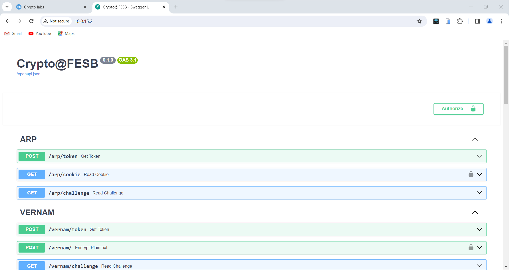

# **Kriptografija i mrežna sigurnost** <!-- omit in toc -->

- [Lab1: Setting up the stage](#lab1-setting-up-the-stage)
  - [Uvod](#uvod)
  - [Pristup serveru](#pristup-serveru)
  - [Pohrana rješenja](#pohrana-rješenja)
    - [Prijava na `gitlab.local`](#prijava-na-gitlablocal)
  - [Postavljanje razvojnog okruženja](#postavljanje-razvojnog-okruženja)
    - [_Visual Studio Code Dev Containers_](#visual-studio-code-dev-containers)
    - [Python virtualno okruženje](#python-virtualno-okruženje)
  - [Važni linkovi](#važni-linkovi)

# Lab1: Setting up the stage

 
<em>Crypto Oracle OpenAPI documentation</em>

## Uvod

Student rješava dio izazova u interackciji sa REST API serverom kojeg kolokvijalno nazivamo **_crypto oracle_**. _Crypto oracle_ generira izazove u obliku šifriranog/enkriptiranog teksta ([Chuck Norris facts](https://api.chucknorris.io/)) kojeg student treba dekriptirati. Dekripcijski ključ student treba otkriti u interakciji sa _crypto oracle_ serverom.

> Uspješnom dekripcijom izazova student, uz novu činjenicu o Chuck Norrisu, otkriva i **_password_** potreban za pristup sljedećoj vježbi.

Server je pisan u Pythonu web okviru [FastAPI](https://fastapi.tiangolo.com/). Izvorni kod servera dostupan je u ovom repozitoriju [crypto-oracle](/crypto-oracle/). Kriptografske funkcije dolaze iz Python biblioteke (*package*) [cryptography](https://cryptography.io).

## Pristup serveru

Za svakog studenta pokreće se personalizirana instanca _crypto oracle_ servera u vidu [Docker](https://www.docker.com/) *container*-a. Za pristup osobnom serveru student treba koristiti računalo koje ima pristup lokalnoj mreži u laboratoriju.

> Spajanjem putem WiFi mreže ne možete ostvariti pristup serveru.

Osobnom serveru pristupate na osnovu odgovarajuće IP adrese. S obzirom da se adrese dodjeljuju dinamički, podložne su promjenama. Trenutnu adresu svog servera možete doznati putem sljedećeg linka: **http://containersinfo.local**.

 
<em>List of student containers</em>

> NAPOMENA: [Upute za pokretanje _crypto oracle_ servera lokalno (npr. na svom osobnom računalu)](/crypto-oracle/README.md).

## Pohrana rješenja

Student pohranjuje izvještaj s rješenjima u odgovarajući repozitorij na **loklanoj instanci GitLab servera** dostupnoj na adresi **http://gitlab.local**. Rješenje uključuje:

- Dešifrirani izazov (činjenicu o Chuck Norrisu)
- Dešifriran _password_ (nužan za otključavanje naredne vježbe)
- Izvorni kod rješenja (Python skripta)
- Odgovore na pripremna pitanja kao i pitanja iz vježbe (gdje se to traži)

 
<em>GitLab server login page</em>

### Prijava na `gitlab.local`

Student se prijavljuje na **lokalni** [GitLab server](http://gitlab.local) s korisničkim imenom i lozinkom izvedenim iz osobnog imena kako je dano u primjeru u nastavku:

| Ime        | Prezime     | `username`            | `password`            |
| :--------- | :---------- | :-------------------- | :-------------------- |
| Ivana      | Ivić        | `ivic_ivana`          | `ivic_ivana`          |
| Marko Ivan | Markovic    | `markovic_marko_ivan` | `markovic_marko_ivan` |
| Mirta      | Marić Banje | `maric_banje_mirta`   | `maric_banje_mirta`   |

## Postavljanje razvojnog okruženja

Preporučamo korištenje Python programskog jezika za rješavanje izazova iako je moguće koristiti proizvoljan programski jezik. _Crypto oracle_ server je pisan u Pythonu pa možete iskoristiti izvorni kod servera kao referencu za rješavanje izazova.

### _Visual Studio Code Dev Containers_

Ovo je preferiran način postavljanja razvojnog okruženja koji osigurava identično razvojno okruženje na svim računalima. Potrebno je u _Visual Studio Code_-u instalirati ekstenziju [Dev Containers](https://marketplace.visualstudio.com/items?itemName=ms-vscode-remote.remote-containers) te osigurati (na Windows i MAC računalima) da je pokrenut [Docker Desktop](https://www.docker.com/products/docker-desktop).

Nakon toga, u _Visual Studio Code_-u jednostavno otvorite repozitorij koji ste klonirali s lokalnog GitLab servera. _Visual Studio Code_ će na osnovu konfiguracijske datoteke `.devcontainer\devcontainer.json` automatski startati odgovarajući razvojni Docker kontejner. Inicijalno pokretanje razvojnog okruženja može potrajati s obzirom da _Visual Studio Code_ preuzima i konfigurira sve potrebne komponente za izgradnju Docker _image_-a. Naknadno pokretanje razvojnog okruženja znatno je brže.

> NAPOMENA: Docker Desktop na Windowsima često koristi WSL2 koji može iscrptiti dostupnu radnu memoriju i usporiti rad računala. Rješenje: [Limiting Memory Usage in WSL2](https://www.aleksandrhovhannisyan.com/blog/limiting-memory-usage-in-wsl-2/)

### Python virtualno okruženje

Alternativno možete postaviti i koristiti [Python virtualno okruženje](https://docs.python.org/3/library/venv.html).

## Važni linkovi

- [Python `cryptography` package](https://cryptography.io)
- [Crypto Oracle source code](/crypto-oracle/)
  
Interni linkovi (dostupni isključivo sa lokalne mreže):

- [What is my _crypto oracle_ container's IP?](http://containersinfo.local)
- [Local GitLab server](http://gitlab.local)