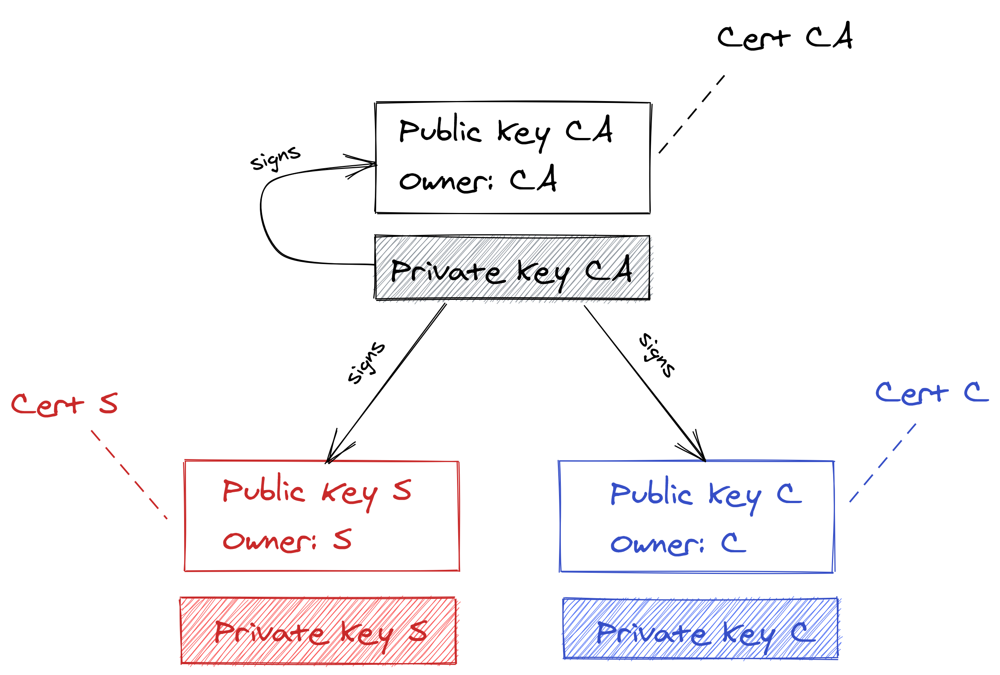
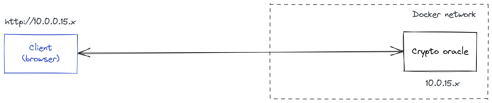
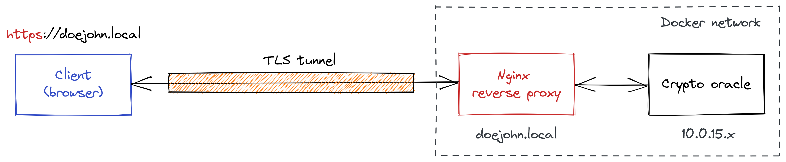

# **Kriptografija i mrežna sigurnost** <!-- omit in toc -->

- [Lab 9: Certificates, TLS protocol and reverse proxy](#lab-9-certificates-tls-protocol-and-reverse-proxy)
  - [Zadatak](#zadatak)
    - [Phase 1](#phase-1)
      - [Create required certificate hierarchy](#create-required-certificate-hierarchy)
      - [Initial configuration of a reverse proxy](#initial-configuration-of-a-reverse-proxy)
    - [Phase 2](#phase-2)
      - [Configure TLS protocol](#configure-tls-protocol)
      - [Configure TLS client certificate authentication](#configure-tls-client-certificate-authentication)

# Lab 9: Certificates, TLS protocol and reverse proxy

U okviru vježbe student će zaštiti pristup _crypto oracle_ server-u primjenom TLS protokola. Cilj vježbe je ostvariti siguran kanal između web preglednika i _crypto oracle_ servera, pri čemu će biti osigurane sljedeće sigurnosne usluge: _confidentiality_, _data and origin integrity_, i zaštita od _replay_ napada.

U okviru vježbe također ćemo demonstrirati primjenu TLS protokola za međusobnu (eng. _mutual_) autentikaciju između servera i klijenta. Pokazat ćemo kako iskoristiti mogućnost TLS protokola za jednostavnu i efikasnu autentikaciju klijenta putem certifikata.

Autentikacija zasnovana na digitalnim certifikatima zahtjeva generiranje i održavanje više tipova certifikata (u formatu x509): _**root certificate authority (CA)**_ certifikat (_**Cert CA**_), certifikat za web server (_**Cert S**_), te klijentski certifikat (_**Cert C**_). Za naše potrebe realizirat ćemo jednostavnu arhitekturu certifikata prikazanu na slici u nastavku. CA certifikat će biti samo-potpisan (_self-signed_), dok će serverski i klijentski certifikat potpisati CA.

<p align="center">

<br>
<em>Certificate hierarchy</em>
</p>

Za potrebe pokretanja vlastitog _certificate authority (CA)_ entiteta student može koristiti izvrstan alat za upravljanje asimetričnim ključevima i certifikatima [XCA](https://www.hohnstaedt.de). Alternativno, možete koristiti OpenSSL - [OpenSSL Certificate Authority](https://jamielinux.com/docs/openssl-certificate-authority).

## Zadatak

Vježbu ćemo odraditi u dvije (2) faze. U prvoj fazi ćemo realizirati hijerarhiju certifikata prikazanu na slici gore. U drugoj fazi ćemo konfigurirati TLS protokol korištenjem certifikata iz prethodne faze. Važan aspekt naše arhitekture je primjena dodatnog servera tzv. _reverse proxy_ servera. _Reverse proxy_ server (u našem slučaju [NGINX](https://www.nginx.com) ) je optimiziran za TLS protokol i na njega kojeg ćemo prebaciti _odgovornost_ za izvršavanje procesorski zahtjevnog TLS protokola (kako je prikazano na slikama u nastavku).

<p align="center">

<br>
<em>(Before) Insecure access to crypto oracle</em>
</p>

<p align="center">

<br>
<em>(After) Securing access to crypto oracle by hiding it behind a reverse proxy</em>
</p>

### Phase 1

#### Create required certificate hierarchy

1. Show that user credentials leak without TLS. Use Wireshark for this.
   - [ ] Capture `username` and `password`
   - [ ] Capture `JWT token`

2. Install and get acquainted with [XCA](https://www.hohnstaedt.de) tool/software.
3. Create certificate hierarchy as shown in the first figure.
4. Export required certificates and private keys and push them to a GitLab repo.
   > IMPORTANT: Please mind the naming convention; refer to the _reverse proxy_ configuration templates provided in the sequel.

#### Initial configuration of a reverse proxy

1. Make sure that your instance of a reverse proxy is up and running. For this, open a web browser and enter the following url: `http://<yourname>.local`.
   > For example, if your username is normally `doe_john` then use the following url: `http://doejohn.local`.

2. To configure your reverse proxy connect to it via SSH with username and password  `root:root` (yes, I'm aware that this is a bad security practice). We will use VSC for this.

    ```bash
    # Assuming you are "doe_john"
    ssh root@doejohn.local
    ```

3. On the reverse proxy navigate to and open directory `/etc/nginx/conf.d` and create a new file in it with an arbitrary name (see below) and an extension `.conf`:

    ```bash
    # Assuming you are "doe_john"
    doejohn.local.conf
    ```

4. Next, copy the following template configuration to the above file (e.g., `doejohn.local.conf`) and update the fields marked with `<...>`.

    ```bash
    server { # simple reverse-proxy
        listen  80;

        # replace <yourname> with your name :-) (notice: without underscore)
        server_name  <yourname>.local;

        proxy_set_header  Host             $host;
        proxy_set_header  X-Real-IP        $remote_addr;
        proxy_set_header  X-Forwarded-For  $proxy_add_x_forwarded_for;

        # pass requests to your REST server (i.e., crypto oracle)
        # lookup your crypto oracle IP address and replace <your_IP_address>
        location / {
            proxy_pass  http://<your_IP_address>:80;
        }
    }    
    ```

5. Save the new configuration file and test its correctness by running the following command:

    ```bash
    nginx -t
    ```

6. Disable the default pre-configured Nginx virtual host:

    ```bash
    unlink /etc/nginx/sites-enabled/default
    ```

7. Finally, restart the NGINX reverse proxy by running:

    ```bash
    service nginx reload
    ```

8. To test that everything has been set up correctly, open a web browser again and enter your url: `http://<yourname>.local` (e.g. `http://doejohn.local`).

Congratulations, you have successfully configured a reverse proxy!

### Phase 2

#### Configure TLS protocol

1. Update a reverse proxy to support TLS protocol. For this update your configuration file from the previous phase (e.g., `doejohn.local.conf`) as follows:

    ```bash
    server { # simple reverse-proxy
        listen  80;
        listen  443 ssl;

        # replace <yourname> with your name :-) (notice: without underscore)
        server_name  <yourname>.local;

        # server certificate and private key
        ssl_certificate            /<path>/<yourname>.local.crt;
        ssl_certificate_key        /<path>/<yourname>.local.key;
        ssl_protocols              TLSv1.2;
        ssl_prefer_server_ciphers  on;
        ssl_ciphers                HIGH:!aNULL:!MD5;
        # openssl ciphers -V 'HIGH:!aNULL:!MD5' (to get actual ciphers)

        add_header 'Content-Security-Policy' 'upgrade-insecure-requests';

        proxy_set_header  Host             $host;
        proxy_set_header  X-Real-IP        $remote_addr;
        proxy_set_header  X-Forwarded-For  $proxy_add_x_forwarded_for;

        # pass requests to your REST server (i.e., crypto oracle)
        # lookup your crypto oracle IP address and replace <your_IP_address>
        location / {
            proxy_pass  http://<your_IP_address>:80;
        }
    }   
    ```

2. For this configuration to work, you should update the fields marked with `<...>` as well as copy appropriate certificates and private keys from your GitLab repo to the reverse proxy. We propose that you create two separate folders in `/etc/nginx/conf.d` (the same folder where your `.conf` file is located), namely, `certs` and `keys`.

   For example, your updated config file could look like:

   ```bash
    ...
    # server certificate and private key
    ssl_certificate            /etc/nginx/conf.d/certs/doejohn.local.crt;
    ssl_certificate_key        /etc/nginx/conf.d/keys/doejohn.local.key;
    ...
   ```

3. Save the new configuration file and test its correctness by running the following command:

    ```bash
    nginx -t
    ```

4. Restart the reverse proxy by running:

    ```bash
    service nginx reload
    ```

5. To test that everything has been set up correctly, open a web browser and enter your url: `https://<yourname>.local` (e.g. `https://doejohn.local`).
   > **IMPORTANT:** Mind the new protocol specifier: `https`.

6. To further your understanding, please run the following tests:
   - [ ] Test `https` connection using IP address only.
   - [ ] Test `https` connection without CA cert in the browser.
   - [ ] Test `https` connection with CA cert added to the browser list of trusted CAa.

#### Configure TLS client certificate authentication

1. Update your configuration file from the previous phase (e.g., `doejohn.local.conf`) as follows:

   ```bash
    server { # simple reverse-proxy
        listen  80;
        listen  443 ssl;

        # replace <yourname> with your name :-) (notice: without underscore)
        server_name  <yourname>.local;

        # server certificate and private key
        ssl_certificate            /<path>/<yourname>.local.crt
        ssl_certificate_key        /<path>/<yourname>.local.key
        ssl_protocols              TLSv1.2;
        ssl_prefer_server_ciphers  on;
        ssl_ciphers                HIGH:!aNULL:!MD5;

        # enable tls client authentication (possible values: on, off, optional)
        # also, specify trusted CA certificate used to verify client certificates
        ssl_verify_client       on;
        ssl_client_certificate  /<path>/<ca_cert>.crt;

        add_header 'Content-Security-Policy' 'upgrade-insecure-requests';

        proxy_set_header  Host             $host;
        proxy_set_header  X-Real-IP        $remote_addr;
        proxy_set_header  X-Forwarded-For  $proxy_add_x_forwarded_for;

        # pass requests to your REST server (i.e., crypto oracle)
        # lookup your crypto oracle IP address and replace <your_IP_address>
        location / {
            if ($ssl_client_verify != SUCCESS) {
                return 403;
            }

            # This is not required but can be useful in combination with
            # "ssl_verify_client optional;" 
            proxy_set_header  X-SSL-Client-Cert-CN  $ssl_client_s_dn;
            # This is required
            proxy_pass  http://<your_IP_address>:80;
        }

        error_page 495 496 =403 /403.html;
    }   
   ```

2. Save the new configuration file, test its correctness, and restart the reverse proxy:

    ```bash
    nginx -t

    # If everything is ok
    service nginx reload
    ```

3. To further your understanding, try to run some tests:
   - [ ] Try to connect to your _crypto oracle_ server again. Please use Firefox for this (it will be clear why later).
   - [ ] Understand the problem you encounter and try to fix it.
   - [ ] Open another web browser and try to connect to _crypto oracle_ server. Understand the observed situation.
   - [ ] Play with `ssl_verify_client` directive by switching from `on` to `optional`; do not forget to restart the proxy after any change in the configuration file.
   - [ ] Think how to make use of `ssl_verify_client optional` and `proxy_set_header  X-SSL-Client-Cert-CN  $ssl_client_s_dn` directives to replace or strengthen password-based login.
  
        When setting `ssl_verify_client optional`, of course you want to comment the following part in the configuration file:

        ```bash
        # if ($ssl_client_verify != SUCCESS) {
        #     return 403;
        # }
        ```

I hope you realize now how powerfull TLS protocols is. Let me just add that you use TLS protocol each time you connect to Eduroam WiFi network (and similar WPA Enterprise WiFi networks), or when you use VPN solutions like OpenVPN. Likewise, your antivirus software gets fresh virus signatures over a secure TLS connection...ok, I will stop here.