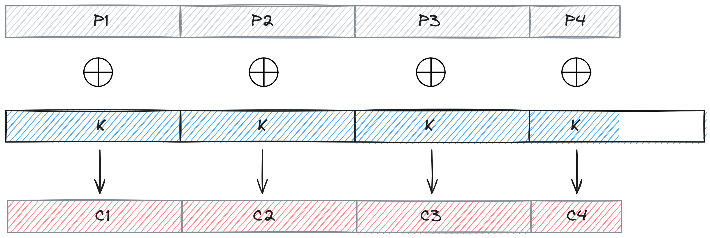

# **Kriptografija i mrežna sigurnost** <!-- omit in toc -->

- [Lab 3: A thin line between perfect cipher and insecure one](#lab-3-a-thin-line-between-perfect-cipher-and-insecure-one)
  - [Vernamova šifra na _crypo oracle_-u](#vernamova-šifra-na-crypo-oracle-u)
  - [Zadatak](#zadatak)
    - [Dohvatite `token`](#dohvatite-token)
    - [Enkripcija proizvoljne poruke (_Chosen-Plaintext Attack - CPA_)](#enkripcija-proizvoljne-poruke-chosen-plaintext-attack---cpa)
    - [Dekriptirajte `challenge`](#dekriptirajte-challenge)
  - [Smjernice za automatizaciju u Pythonu](#smjernice-za-automatizaciju-u-pythonu)
    - [Modularizirajte kod (primjer dohvaćanja `token`-a)](#modularizirajte-kod-primjer-dohvaćanja-token-a)
    - [Vernamova šifra](#vernamova-šifra)
    - [Slanje autoriziranog HTTP zahtjeva](#slanje-autoriziranog-http-zahtjeva)
    - [Dekodiranje `base64` stringa u `bytes`](#dekodiranje-base64-stringa-u-bytes)

# Lab 3: A thin line between perfect cipher and insecure one

Vidjeli smo već u uvodnim predavanjima da je moguće zaštiti povjerljivost podataka na način da čak i jako napredni napadač, bez obzira na raspoloživu procesorsku snagu, ne može izvući ili naučiti nikakve informacije iz enkriptiranih poruka. Ovakvo svojstvo šifri nazvali smo _perfect secrecy_. Primjer takve šifre je _one-time pad_. _One-time pad_ možemo realizirati primjenom _Vernamova algoritma_ tako da enkripcijski ključ biramo nasumično za svaku poruku, te da je njegova duljina jednaka duljini poruke koja se enkriptira.

U okviru vježbe vidjet ćemo posljedice zanemarivanja ovih zahtjeva, odnosno kako trivijalno narušiti povjerljivost Vernamove šifre ako se ne pridržavamo zahtjeva za veličinu enkripcijskog ključa. Također ćemo se upoznati s novom kategorijom napada, **_chosen-plaintext attack (CPA)_**.

## Vernamova šifra na _crypo oracle_-u

_Crypto oracle_ koristi Vernamovu šifru na sljedeći način: 

1. **Inicijalna faza:**

    - _Crypto oracle_ nasumično generira tajni enkripcijski ključ $K$ duljine 32 bajta (256 bita). Ovaj ključ zatim koristi za enkripciju svih poruka.

2. **Postupak enkripcije poruka:**

   - Poruka $P$ (_plaintext_) se dijeli se u blokove duljine 32 bajta (256 bita): $P = P_1 P_2 ... P_n$.
   - Svaki blok $P_i$ enkriptiramo primjenom Vernamove šifre kako slijedi: $C_i = P_i \oplus K$.
   - Enkriptirana poruka (_ciphertext_): $C = C_1 C_2 ... C_n$.

<p align="center">

</p>

   > NAPOMENA: Zadnji blok poruke ($P_n$) može biti kraći od 32 bajta (256 bita). U tom slučaju, _crypto oracle_ uzima samo onoliko bajtova ključa $K$ koliko je potrebno za enkripciju zadnjeg bloka $P_n$.

## Zadatak

Dekriptirati odgovarajući izazov (_challenge_) koji je enkriptiran Vernamovom šifrom na _crypto oracle_ serveru kako je [prikazano ranije](#vernamova-šifra-na-crypo-oracle-u). Iskoristite činjenicu da _crypto oracle_ koristi isti tajni enkripcijski ključ duljine 32 bajta (256 bita) za enkripciju svih poruka (uključujući i one koje mu vi pošaljete).

Zadatak u fazama: `username & password` ⇒ `token` ⇒ `challenge`.

> SUGESTIJA: Razradite problem/zadatak korištenjem "primitivnih" alata poput olovke i papira. Tek tada pristupite implementaciji u Python-u ([smjernice u nastavku](#smjernice-za-automatizaciju-u-pythonu) i koristite MS Edge Copilot ili ChatGPT).

### Dohvatite `token`

Tekuća faza: `username & password` ⇒ **`token`** ⇒ `challenge`.

U ovoj vježbi šaljete `HTTP POST` zahtjeve _crypto oracle_-u na zaštićen _path_ `/vernam`. Za uspješan `POST /vernam` trebate odgovarajući autentikacijski `token` kojeg možete dobiti od _crypto_oracle_ servera u zamjenu za odgovarajući `password`. Prisjetite se, `password` je dio `challenge`-a kojeg ste dekriptirali u prethodnoj vježbi.

### Enkripcija proizvoljne poruke (_Chosen-Plaintext Attack - CPA_)

Možete tražiti od _crypto oracle_-a enkripciju proizvoljne poruke. Zahtjev za enkripciju proizvoljne poruke šalje se na _path_ `/vernam` i zahtijeva sljedeće parametre:

- `token` - autentikacijski token dobiven u prethodnom koraku
- `plaintext` - poruka koju želite enkriptirati

Student ima slobodu izabrati proizvoljnu poruku koju želi enkriptirati. _Crypto oracle_ će enkriptirati poruku primjenom Vernamove šifre, koristeći identičan ključ $K$ kao i za enkripciju _crypto_ izazova. Nakon što _crypto oracle_ izvrši enkripciju, vratit će odgovarajući _ciphertext_.

> **DEFINICIJA**: U kontekstu ovog zadatka, napadač (vi) može tražiti od _crypto oracle_ servera enkripciju proizvoljne poruke, što predstavlja oblik napada poznat kao _Chosen-Plaintext Attack (CPA)_.

### Dekriptirajte `challenge`

Tekuća faza: `username & password` ⇒ `token` ⇒ **`challenge`**.

Razmislite (olovka i papir) kako iskoristiti propust u načinu na koji se enkriptiraju `challenge` i vaše `plaintext` poruke. Implementirajte odgovarajući _chosen-plaintext attack_ s ciljem otkrivanja/dekripcije `challenge`-a.

## Smjernice za automatizaciju u Pythonu

### Modularizirajte kod (primjer dohvaćanja `token`-a)

```python
import requests

def get_access_token(username, password, url):
    response = requests.post(
        url,
        headers={"Content-Type": "application/x-www-form-urlencoded"},
        data={"username": username, "password": password}
    )
    response.raise_for_status()
    return response.json().get("access_token")

if __name__ == "__main__":
    username = "username"
    password = "password"
    url = "http://your_IP_address/vernam/token"

    # Step 1: Get the token
    token = get_access_token(username, password, url)
    print(token)
```

### Vernamova šifra

```python
def xor_cipher(key: bytes, plaintext: bytes) -> bytes:
    if len(key) != len(plaintext):
        raise ValueError("Key and plaintext lengths must match.")
    
    ciphertext = bytes(a ^ b for a, b in zip(key, plaintext))
    return ciphertext
```

### Slanje autoriziranog HTTP zahtjeva

U _chosen-plaintext_ napadu tražite od servera da enkriptira _plaintext_ po vašem izboru.

```python
import requests

def encrypt_chosen_plaintext(plaintext: str, token: str, url: str) -> str:
    response = requests.post(
        url=url,
        headers={
            "Authorization": f"Bearer {token}",
            "Content-Type": "application/json"
        },    
        json={"plaintext": plaintext}
    )

    response.raise_for_status()
    return response.json().get("ciphertext")

if __name__ == "__main__":
    plaintext = "xyz"
    token = "your_token"
    url = "http://your_IP_address/vernam"

    # Step 2: Encrypt plaintext
    ciphertext = encrypt_plaintext(plaintext, token, url)
    print(ciphertext)
```

### Dekodiranje `base64` stringa u `bytes`

```python
def decode_base64_to_bytes(encoded_string: str) -> bytes:
    return b64decode(encoded_string)

# Example usage:
encoded_string = "VGhpcyBpcyBhIHN0cmluZw=="
decoded_bytes = decode_base64_to_bytes(encoded_string)
print(decoded_bytes)
```
